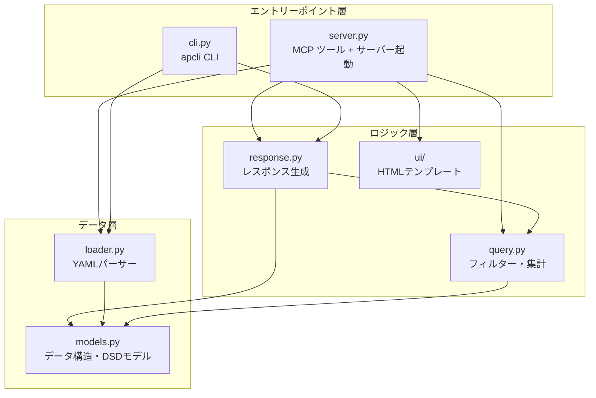
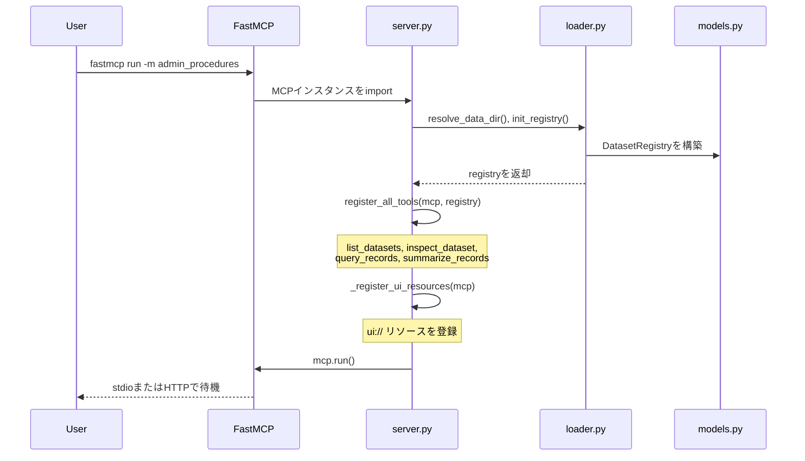

# 開発ガイド

## 1. プロジェクト概要

本プロジェクトは、行政手続に関するデータセットを MCP（Model Context Protocol）経由で検索・集計するためのサンプル実装です。

提供する MCP ツールは、次の 4 つに限定しています。

| ツール | 役割 |
|---|---|
| `list_datasets` | 利用可能なデータセットの一覧を取得する |
| `inspect_dataset` | データセットの構造、フィールド、コードリスト、品質情報を確認する |
| `query_records` | 条件を指定してレコードを検索する |
| `summarize_records` | グループ化や集計をサーバー側で実行する |

SDMX/DSD（Data Structure Definition）の考え方を参考に、メタデータ駆動の構成を採用しています。ツール数を増やしすぎず、各ツールの責務を明確にすることで、LLM が適切なツールを選択しやすくしています。

主な設計方針は次のとおりです。

- `dataset.yaml` にフィールドの役割、コードリスト、注意事項を記述し、AI による推測を減らす。
- 集計処理は、可能な限りサーバー側で実行する。
- 応答には、出典情報（provenance）、注意事項（notes）、記入率などの品質情報を含める。
- ロジック層の `response.py` は MCP に依存させない。
- `server.py` は入力値の変換と `ToolResult` の生成を担う薄いアダプターにする。
- MCP サーバー、CLI、テストから同じロジック層を利用する。
- 新しいデータセットは、YAML と Parquet を配置するだけで追加できるようにする。

### 1.1 適用範囲と信頼境界

本プロジェクトは、公開データを題材に MCP による検索・集計と MCP Apps を検証するための実験用サンプルです。ローカル実行または管理された単一利用者による試用を主な対象とし、複数利用者向けの本番サービス、共通データ基盤、機密情報を扱うシステムに必要な可用性・利用者分離・監査機能は対象外です。

| 対象 | 前提と責任範囲 |
|---|---|
| `dataset.yaml` | 信頼済み入力として扱う。取得先 URL、ローカルファイルの位置を指定できるため、出所不明の YAML は読み込まない |
| `apcli fetch` | 利用者が内容を確認した `dataset.yaml` に対して明示的に実行する。HTTPS、応答サイズ、リダイレクト等の基本的な防御は行うが、任意の設定ファイルを安全に実行するサンドボックスではない。接続先を制限したい場合は `--allowed-host` で許可ホストを指定できる |
| stdio / CLI | ローカル利用を基本とする。OS ユーザーの権限でデータファイルを読み込む |
| HTTP transport | 単一Bearer tokenの検証は提供する。複数利用者向けの認可・レート制限・監査ログはGateway等で補う |
| `apcli preview` | localhost での UI 検証専用。`--unsafe-expose` は隔離された検証環境に限定し、インターネットや共有ネットワークへ公開しない |

## 2. プロジェクト構成

```text
.
├── pyproject.toml                  # パッケージ定義、依存関係、CLIエントリーポイント
├── docs/
│   ├── development.md              # 本ドキュメント
│   └── dataset-yaml-guide.md       # dataset.yamlの記述ガイド
├── datasets/
│   └── procedures-survey-r6/       # データセット定義
│       ├── dataset.yaml
│       └── data.parquet            # 本セットには未同梱。別途生成が必要
├── setup.sh                        # clone直後の初期セットアップ
├── .mcp.json                       # Claude Code用MCPサーバー定義
├── src/admin_procedures/           # メインパッケージ
│   ├── __init__.py
│   ├── __main__.py                 # python -m admin_proceduresのエントリーポイント
│   ├── models.py                   # DatasetRegistry、DSDモデル、フィールド定義
│   ├── loader.py                   # YAMLパーサー、データディレクトリ解決、レジストリ初期化
│   ├── query.py                    # フィルター、集計、ページネーション
│   ├── response.py                 # MCP非依存のレスポンス生成と実行パイプライン
│   ├── server.py                   # MCP入力の変換、ToolResult生成、ツール登録
│   ├── cli.py                      # apcli CLI
│   ├── prepare_dataset.py          # CSVからYAMLとParquetを生成
│   ├── preview.py                  # MCP Appsプレビューホスト
│   └── ui/
│       ├── __init__.py             # load_template()、render_standalone()
│       ├── base.css / base.js      # 共通CSS / JS
│       ├── echarts.min.js          # ECharts
│       ├── preview_host.html       # プレビューホストページ
│       └── *.html                  # 各ツールのUIテンプレート
└── tests/                          # テスト
```

## 3. アーキテクチャ

### 3.1 ソースコードの依存関係



| 層 | 主な役割 |
|---|---|
| エントリーポイント層 | MCP サーバーや CLI からの入力を受け付ける |
| ロジック層 | 検索、集計、レスポンス生成、UI 描画用データの作成を行う |
| データ層 | YAML 定義の読み込みとデータ構造の管理を行う |

MCP 固有の処理を `server.py` に限定することで、検索・集計ロジックを CLI やテストからも共通利用できる構成にしています。

### 3.2 サーバー起動シーケンス



起動時には、データディレクトリの解決、`dataset.yaml` の読み込み、`DatasetRegistry` の構築、4 つの MCP ツール登録、MCP Apps 用 UI リソース登録を行います。

## 4. 実行環境と依存関係

### 4.1 環境変数

| 環境変数 | デフォルト値 | 説明 |
|---|---|---|
| `ADMIN_PROCEDURES_DATA_DIR` | 未設定 | `datasets/` を含むディレクトリのパス |
| `ADMIN_PROCEDURES_PORT` | 未設定 | 設定すると streamable HTTP transport でサーバーを起動する |
| `PORT` | 未設定 | PaaS互換のHTTPポート。`ADMIN_PROCEDURES_PORT` が優先 |
| `ADMIN_PROCEDURES_HOST` | `127.0.0.1` | HTTP transport のバインドアドレス（`ADMIN_PROCEDURES_PORT` 設定時のみ有効） |
| `ADMIN_PROCEDURES_PUBLIC` | 未設定 | `1` を設定すると `ADMIN_PROCEDURES_HOST=0.0.0.0` でバインド（公開モード）。公開時はリバースプロキシの認証設定が必須 |
| `ADMIN_PROCEDURES_TRANSPORT` | `streamable-http` | HTTP transport。`streamable-http` または `sse` |
| `ADMIN_PROCEDURES_PATH` | transport既定 | MCPエンドポイントのパス |
| `MCP_AUTH_TOKEN` | 未設定 | 設定すると32文字以上のBearer token認証を有効化 |
| `ADMIN_PROCEDURES_REQUIRE_AUTH` | 未設定 | `1` の場合、Token未設定なら起動を拒否 |
| `ADMIN_PROCEDURES_AUTH_CLIENT_ID` | `notion-custom-mcp` | 認証済み接続に付与するclient ID |
| `MCP_NO_UI` | 未設定 | `1` を設定すると MCP Apps UI を無効化する |

### 4.2 Python ランタイム

| パッケージ | バージョン | 用途 |
|---|---|---|
| [polars](https://pola.rs/) | `>=1.0` | LazyFrame による検索・集計、CSV から Parquet への変換 |
| [PyYAML](https://pyyaml.org/) | `>=6.0` | `dataset.yaml` の読み込み |
| [FastMCP](https://gofastmcp.com/) | `>=3.2.0` | MCP サーバーフレームワーク |
| [click](https://click.palletsprojects.com/) | `>=8.0` | `apcli` のコマンド定義 |

FastMCP 3.x の CLI は Cyclopts ベースであり、Click には依存しません。そのため、Click は本プロジェクトの直接依存として `pyproject.toml` に定義しています。

### 4.3 フロントエンドと開発用パッケージ

フロントエンドライブラリは `ui/` 配下に同梱し、HTML にインライン注入します。

| 種別 | パッケージ | バージョン | 用途 |
|---|---|---|---|
| フロントエンド | [Apache ECharts](https://echarts.apache.org/) | `6.1.0` | 棒グラフ、円グラフ、ヒートマップ、ツリーマップ、サンキー図などの描画 |
| 開発 | [pytest](https://docs.pytest.org/) | `>=9.0.2` | テスト実行 |

## 5. 入力制限と計算量上限

MCP ツールはリソース消費抑制のため、以下の入力制限を実施しています。

### query_records の制限

| パラメータ | 制限 | 説明 |
|-----------|------|------|
| `q` | 1024文字以内 | 全文検索キーワード |
| `search_fields` | フィールド数以内 | 検索対象フィールド数 |
| `select` | フィールド数以内 | 出力フィールド数 |
| `where` | 200フィールド以内 | フィルタ条件のフィールド数 |
| `where` 配列 (IN / contains) | 200要素以内 | 1 フィルタ条件の配列サイズ |
| `limit` | 1〜5,000 | 返却レコード数（デフォルト 50） |
| `cursor` | 2 KiB以内 | ページネーションカーソル |

### summarize_records の制限

| パラメータ | 制限 | 説明 |
|-----------|------|------|
| `metrics` | 200個以内 | 集計メジャー数 |
| `group_by` | 200フィールド以内 | クロス集計の軸数 |
| `where` | 200フィールド以内 | フィルタ条件のフィールド数 |
| `limit` | 1〜10,000 | 返却グループ数（デフォルト 200） |

### エラーハンドリング

制限を超えた入力は MCP の **ToolInputError** として拒否されます。
エラーメッセージに詳細が含まれます。

**例：**
```json
{
  "error": "q は 1024 文字以内です（入力: 2048 文字）"
}
```

**制御文字の制限：**
メタデータ（`title`, `publisher`）は改行（`\n`, `\r`）および制御文字（`\t`, `\x00`, `\x1b` など）を含む場合は拒否されます。

## 5.1 MCP 仕様と FastMCP 互換性

本プロジェクトは FastMCP 3.x と 4.x の両系列で動作するように設計しています。実際に使用される MCP 仕様バージョンは、インストールされている FastMCP と MCP SDK のバージョンによって決まります。

| インストール構成 | FastMCP | MCP SDK | MCP 仕様 |
|---|---|---|---|
| 既定の構成（`pip install -e .`） | 3.x | 1.x | `2025-11-25` |
| FastMCP 4.xプレリリースを追加 | 4.x | 2.x | `2026-07-28` |

HTTP transport で起動している場合、実際の MCP 仕様バージョンは `/health` の `mcp_protocol_version` で確認できます。

```bash
curl localhost:8000/health
```

応答例：

```json
{
  "status": "healthy",
  "mcp_protocol_version": "2026-07-28"
}
```

MCP 仕様 `2026-07-28` で動かす場合は、FastMCP 4.x と MCP SDK 2.x をインストールします。

```bash
pip install --pre "fastmcp>=4.0.0b1"
```

FastMCP 4.x 使用時の注意事項は次のとおりです。

- FastMCP 4.x は、執筆時点ではプレリリース版の `4.0.0b1` です。
- FastMCP 4.x は Cyclopts 5.x alpha に依存しています。
- CI では `pytest-spec-2026` ジョブで FastMCP 4.x の回帰を監視しています。
- `pytest-spec-2026` は `continue-on-error` のため、FastMCP 4.x での失敗は通常の CI 成功をブロックしません。
- 本番環境では、既定の FastMCP 3.x の使用を推奨します。

## 6. テスト

### 6.1 実行方法

```bash
python -m pytest tests/ -x
```

`-x` を指定すると、最初のテスト失敗時に実行を停止します。

### 6.2 テスト構成

| ファイル | 主な内容 |
|---|---|
| `test_server.py` | `_FakeMCP` を使用した MCP ツールの登録・呼び出しテスト |
| `test_procedures.py` | 集計、ページネーション、DSD バリデーション、provenance などのユニットテスト |
| `test_cli.py` | CLI のバリデーション、基本コマンド、取得元の検証 |
| `test_loader.py` | YAML/DSD の読み込み、自動登録 |
| `test_response.py` | レスポンス生成処理の回帰テスト |
| `test_mcp.py` | MCP インスタンス生成、キャッシュヒント宣言 |
| `test_preview.py` | プレビューホスト、HTTP エンドポイント、Host/CSRF 検証 |
| `test_limits.py` | 入力長、配列サイズ、クエリ・集計上限の検証 |
| `conftest.py` | 共有フィクスチャ、4 件のサンプルデータ、テスト用レジストリ |

### 6.3 テストデータ

`test_cli.py` のうち `procedures-survey-r6` に依存するテストでは、約 100 MB の実データセットをダウンロードしません。代わりに、`conftest.py` で定義した 4 件のサンプルレコードを各テスト実行時に一時ディレクトリへ生成します。

これにより、CI 実行時間の増加、外部ネットワーク依存、大容量データのダウンロード失敗を避けています。

サンプルデータは、次のテストクラスに自動適用されます。

| テストクラス | 検証内容 |
|---|---|
| `TestQueryUnknownSelect` | 未知のフィールドを指定した場合のエラー |
| `TestSummarizeUnknownExplode` | 展開対象に不正なフィールドを指定した場合のエラー |
| `TestSummarizeNonGroupable` | groupable でないフィールドの検証 |
| `TestSummarizeUnknownGroupBy` | 未知のグループ化フィールドの検証 |
| `TestCLIBasicCommands` | CLI の基本コマンド |

`TestAddCommand` など、その他のテストクラスでは、テストごとに独自の CSV フィクスチャを使用します。

## 7. MCP Apps UI とプレビュー

Claude Code は MCP Apps UI を描画しないため、本プロジェクトでは 3 つの確認方法を用意しています。

| 方法 | 用途 |
|---|---|
| 静的プレビュー | `apcli <command> --html` または `-o` で自己完結型 HTML を出力し、ブラウザで確認する |
| 対話プレビュー | `apcli preview` で SEP-1865 準拠のプレビューホストを localhost に起動し、内蔵 AI と UI 描画を通しで確認する |
| 外部ホスト確認 | `basic-host` や MCPJam Inspector に接続し、実ホストに近い挙動を確認する |

### 7.1 静的プレビュー

各 `apcli` コマンドに `--html` または `-o` を指定すると、`render_standalone()` が生成する自己完結型 HTML を出力できます。

```bash
apcli <command> --html
apcli <command> -o output.html
```

HTML にはデータが埋め込まれているため、ブラウザで直接開くだけで確認できます。

### 7.2 対話プレビュー

`apcli preview` は、`preview.py` と `ui/preview_host.html` を使って SEP-1865 準拠のプレビューホストを起動します。Chrome では Gemini Nano、Microsoft Edge では Phi-mini を利用し、ユーザーの質問から呼び出す MCP ツールを選択します。

```bash
apcli preview [OPTIONS]
```

| オプション | デフォルト | 説明 |
|---|---|---|
| `--port PORT` | `8765` | 待ち受けポート |
| `--host HOST` | `127.0.0.1` | バインドするホスト（既定は localhost のみ） |
| `--unsafe-expose` | 指定なし | 非 loopback (0.0.0.0 など) へのバインドを許可 |
| `--no-open` | 指定なし | ブラウザを自動で開かない |

実行例：

```bash
apcli preview
apcli preview --port 9000
apcli preview --no-open
```

既定では、次の URL で起動します。

```text
http://127.0.0.1:8765
```

Prompt API には直接的なツール呼び出し機能がないため、`responseConstraint` に JSON Schema を指定し、モデルに `tool_call` または `answer` を選択させます。ツール実行後は、次の流れで UI を描画します。

```text
ui/initialize
    ↓
ui/notifications/tool-result
    ↓
iframe内でUIを描画
    ↓
必要に応じてtools/callでドリルダウン
```

### 7.3 対応ブラウザ

| ブラウザ | 対応バージョン | 使用モデル | 初期設定 |
|---|---|---|---|
| Chrome | 138以降 | Gemini Nano | `chrome://flags/#prompt-api-for-gemini-nano` を Enabled にする。続いて `chrome://flags/#optimization-guide-on-device-model` を Enabled BypassPerfRequirement にし、Chrome を再起動する |
| Microsoft Edge | 131以降 | Phi-mini | `edge://flags` で「Prompt API for on-device language model」を Enabled にし、Edge を再起動する |

いずれのブラウザも、初回利用時にはモデルのダウンロードが発生します。ダウンロード UI はブラウザのガイドラインに沿って実装しています。

- ダウンロードは、ユーザーがバナーのボタンを押した場合のみ開始する。
- ダウンロード中は `<progress>` で進捗を表示する。
- ダウンロード後の展開中は、進捗を indeterminate 表示にする。
- モデルの準備が完了するまで、チャット入力を有効化しない。
- `availability()` には `create()` と同じ言語オプションを渡す。

初回ダウンロードの挙動を確認する場合は、空のユーザープロファイルで Chrome を起動します。

```bash
chrome --user-data-dir=$(mktemp -d)
```

### 7.4 使用フロー

1. `apcli preview` を実行し、ブラウザでプレビューホストを開く。
2. `list_datasets` が自動実行され、データセット一覧がタイル形式で表示される。
3. データセットのタイルをクリックする。
4. 選択したデータセットに対して `inspect_dataset` が自動実行される。
5. チャット欄に質問を入力する。
6. 内蔵 AI が `list_datasets`、`inspect_dataset`、`query_records`、`summarize_records` から適切なツールを選択する。
7. 実行結果が iframe 内のチャートやテーブルとして描画される。
8. 必要に応じて、チャートやテーブルから詳細データへドリルダウンする。

### 7.5 外部ホストによる互換性確認

より実際の MCP Apps ホストに近い環境で確認する場合は、次のツールを利用します。

- [basic-host](https://github.com/modelcontextprotocol/ext-apps/tree/main/examples/basic-host): `ext-apps` に含まれる公式リファレンスホスト。Node.js が必要です。

sandbox iframe proxy など、実際のホスト固有の挙動は外部ホストで確認します。

### 7.6 トラブルシューティング

| 問題 | 主な原因 | 対応方法 |
|---|---|---|
| 「内蔵AI: 利用不可」と表示される | モデルがダウンロードされていない、またはブラウザ設定が無効 | 対応するフラグを有効化し、ブラウザを再起動する |
| プレビューホストが起動しない | 指定したポートが使用中 | `--port` で別のポートを指定する |
| UI が描画されず JSON が表示される | iframe またはテンプレートの描画に失敗している | 開発者ツールを開き、コンソールエラーを確認する |
| モデルのダウンロードが進まない | ディスク容量またはネットワークに問題がある | 22 GB 以上の空き容量とネットワーク接続を確認する |

## 8. SLM ハーネスの設計

> SLM やブラウザ内蔵 AI の仕様、性能、提供条件は変化が激しいため、この章で説明する SLM ハーネスは、テスト実装・実験的実装です。

対話プレビューでは、段取りと状態管理を JavaScript のハーネスが担い、検索・集計クエリの構築を SLM（Gemini Nano または Phi-mini）が担います。

小型モデルに複数段階の探索を任せると、ツール選択や引数生成が不安定になりやすいため、データセットの発見と構造確認はハーネス側で実行します。

ページ起動時には、次の処理を可視のツール実行として行います。

```text
list_datasets
    ↓
inspect_dataset
    ↓
フィールド情報と品質情報をローカルに保存
    ↓
システムプロンプトへ注入
```

保存する情報には、フィールド名、説明、`group_by` 可否、`sum`/`avg` 可否、記入率、コードリスト、注意事項が含まれます。以降の呼び出しでは、`dataset_id` の列挙値、フィールド名補正、品質注記、過去の観測結果としてこの情報を参照します。

SLM は、原則として 1 回の `summarize_records` または `query_records` で回答に必要な情報を取得します。few-shot は「質問 → ツール呼び出し JSON → ツール実行結果 → 最終回答」の 3 例に限定し、例中の数値やフィールド名をそのまま再利用するリスクを抑えます。

### 8.1 設計原則

| 原則 | 内容 |
|---|---|
| 汎用性 | ハーネスのプロンプト、few-shot、入力例のチップは `/api/describe`、`list_datasets`、`inspect_dataset` の結果だけから生成する。データセット固有の文言は JavaScript コードへ埋め込まない |
| MCP ツール非改変 | SLM の精度向上はハーネス側で行う。MCP ツール定義やサーバー実装は変更しない |
| 実測駆動 | キー名の多言語化、壊れた JSON、few-shot 数値の流用など、実際に観測された問題に対してのみ対策を追加する |

ハーネス側の主な対策は、JSON Schema による出力制約、引数のサニタイズ、フィールド名の補正、壊れた JSON に対する修復リプロンプト、品質情報やルールのシステムプロンプトへの注入です。

### 8.2 補助機能

| 機能 | 既定 | 説明 |
|---|---|---|
| CoT（plan-then-act） | 無効 | `?cot=1` で有効化する。制約付き出力の前に 1 行の計画を生成させ、低記入率フィールド使用時の注意も書かせる。実測では計画だけで満足してツールを呼ばない脱線が多いため、A/B 比較用に留める |
| リフレクション誘導 | 有効 | ツール結果が 0 件またはエラーの場合、条件や引数を見直して再試行するよう促す |
| カタログキャッシュ | フォールバック用 | セッション開始時は毎回 `list_datasets` と `inspect_dataset` を可視実行する。保存済み情報は `inspect_dataset` 失敗時のみ使う |
| 教訓メモリ | 無効 | `?lessons=1` で有効化する。0 件またはエラーになった呼び出しと、その後成功した呼び出しを記録し、次回のシステムプロンプトへ「過去の教訓」として注入する |
| 観測ストア | 有効 | 成功した呼び出しから、group_by のグループ数、上位値、キーワード該当件数、成功した検索条件などを保存し、関連する質問にだけ追加する |

## 9. データセットの追加

新しいデータセットは、コードを変更せずに追加できます。作業は 3 段階です。

### Step 1: CSV から YAML テンプレートと Parquet を生成する

```bash
python -m admin_procedures.prepare_dataset my-dataset \
  --csv path/to/data.csv
```

`prepare_dataset.py` が CSV を分析し、次のファイルを生成します。

```text
datasets/my-dataset/
├── dataset.yaml
└── data.parquet
```

生成される `dataset.yaml` では、各フィールドの役割が自動推定されます。

| role | 用途 |
|---|---|
| `id` | レコードを識別するフィールド |
| `dim` | 分類やグループ化に使用するフィールド |
| `measure` | 合計や平均などの集計対象 |
| `attr` | 補足情報や属性 |

自動生成直後の YAML では、`desc` や `notes` などが未記入の場合があります。

### Step 2: YAML を補完する

項目説明資料がある場合は、次の資料を生成 AI などに読み込ませると効率的です。

| 読み込ませるもの | 用途 |
|---|---|
| `dataset-yaml-guide.md` | YAML の記述仕様を確認する |
| 項目説明資料 | 各フィールドの意味、許容値、入力ルールを確認する |
| 生成済みの `dataset.yaml` | 補完対象 |

指示例：

> `dataset-yaml-guide.md` の仕様に従い、項目説明資料の内容をもとに、`dataset.yaml` の `desc`、`codelist`、`notes`、`computed_measures` を補完してください。

生成結果はそのまま利用せず、人手で確認・調整します。特に、次の項目を確認してください。

- `codelist` の値が、実際のデータと一致しているか。
- 数値項目の解釈上の注意を `notes` に記述しているか。
- `0` と「不明・欠損」を区別できているか。
- `computed_measures` の分子・分母のフィールド名が正しいか。
- 更新日時や内部フラグなど、利用者に不要な管理項目を除外しているか。

### Step 3: YAML に基づいて Parquet を再生成する

YAML でフィールドを追加、削除、変更した場合は、Parquet を再生成します。

```bash
python -m admin_procedures.prepare_dataset my-dataset \
  --csv path/to/data.csv
```

対象ディレクトリに `dataset.yaml` が存在する場合、`prepare_dataset.py` は自動的に convert モードで動作し、YAML 定義に基づいて CSV を変換します。

詳しい記述方法は [dataset-yaml-guide.md](dataset-yaml-guide.md) を参照してください。

## 10. CSV から Parquet への変換仕様

| CSVの値 | 文字列カラム | 数値カラム（`data_type: integer`） |
|---|---|---|
| 値あり | 文字列として保持 | `int64` に変換 |
| 空文字列 `""` | `null` | `null` |
| 数値に変換できない文字列 | 文字列として保持 | `null` |

数値カラムの空セルは、`0` ではなく `null` として保持します。

| 値 | 意味 |
|---|---|
| `null` | データなし、不明、未回答 |
| `0` | 値がゼロであることが確認されている |

この区別は、集計結果や記入率を正しく解釈するうえで重要です。

## 10.1 メタデータの検証

`dataset.yaml` の `title` および `publisher` フィールドは自動的にサニタイズされます：

- **長さ制限**: 最大 256 文字
- **文字制限**: 改行（`\n`, `\r`）および制御文字（`\t`, `\x00`, `\x1b` など）は拒否

## 11. 貢献について

本プロジェクトは、技術検証を目的として公開しているサンプルコードです。

原則として、外部からの機能追加、仕様変更、リファクタリング等のコントリビューションは受け付けていません。Issue 等いただいた場合でも、対応やマージを行わないことがありますので、あらかじめご了承ください。
